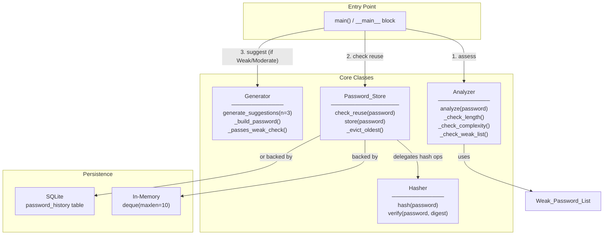

# Design Document: Password Strength Analyzer

## Overview

The Password Strength Analyzer is a production-ready Python tool organized around four cooperating classes: **Analyzer**, **Generator**, **Password_Store**, and **Hasher**. The system evaluates password strength against well-defined criteria, suggests cryptographically secure alternatives when a password is too weak, prevents reuse via a bcrypt-hashed history store, and prints an educational terminal breakdown on direct execution.

The design prioritizes:
- **Correctness** — scoring logic is deterministic and fully derivable from the requirements.
- **Security** — passwords are never stored in plain text; the `secrets` module is used for all generation.
- **Modularity** — each class can be imported and tested in isolation.
- **Portability** — the only non-stdlib dependency is `bcrypt` (with a `hashlib` fallback).

### Key Design Decisions

| Decision | Rationale |
|---|---|
| Single-file script with four classes | Satisfies "runnable as a single Python script" while keeping logical boundaries clear |
| `secrets` module for generation | Cryptographically secure; purpose-built for credentials |
| bcrypt cost factor ≥ 10 | Industry minimum recommendation; resistant to GPU-accelerated brute-force |
| LRU cap of 10 via `collections.deque` | O(1) eviction; no extra dependencies |
| SQLite for optional persistence | Ships with the standard library; zero extra deps |
| `hashlib.sha256` fallback | Graceful degradation when `bcrypt` is unavailable |

---

## Architecture



### Flow Summary

1. `main()` calls `Analyzer.analyze(password)` → receives `AnalysisResult`.
2. `main()` calls `Password_Store.check_reuse(password)` → boolean.
3. If `AnalysisResult.tier` is Weak or Moderate, `main()` calls `Generator.generate_suggestions()` → list of 3 strings.
4. If the password is Strong/Very Strong and not reused, `main()` calls `Password_Store.store(password)`.

---

## Components and Interfaces

### 4.1 Analyzer

```python
@dataclass
class AnalysisResult:
    score: int                  # 0–6, clamped
    tier: str                   # "Weak" | "Moderate" | "Strong" | "Very Strong"
    passed: list[str]           # criteria that were satisfied
    failed: list[str]           # criteria that were not satisfied
    error: str | None           # set when input is invalid

class Analyzer:
    def __init__(self, weak_list: list[str] | None = None) -> None: ...

    def analyze(self, password: str) -> AnalysisResult:
        """
        Entry point for strength evaluation.
        Validates input, checks weak list, scores complexity and length,
        clamps the result, and maps to a tier name.
        Returns AnalysisResult with error field set for invalid inputs.
        """
```

**Scoring pipeline (internal)**:

```
score = 0
if password in weak_list (case-insensitive): return score=0, tier="Weak"
score += complexity_points(password)   # 0–4: one per category present
if len(password) < 8: score -= 2       # length penalty
score = max(0, min(6, score))          # clamp
tier  = tier_from_score(score)
```

Complexity categories: uppercase present (+1), lowercase present (+1), digit present (+1), special character present (+1).

### 4.2 Generator

```python
class Generator:
    def __init__(self, weak_list: list[str] | None = None) -> None: ...

    def generate_suggestions(self, n: int = 3) -> list[str]:
        """
        Returns a list of n cryptographically secure password strings,
        each 16–128 chars, containing all four complexity categories.
        Uses a one-retry weak-list check per suggestion.
        """

    def _build_password(self, length: int = 20) -> str:
        """
        Constructs a single password by sampling from the full printable-ASCII
        alphabet via secrets.choice, then guaranteeing at least one character
        from each required category via secrets.choice on category subsets,
        and shuffling the result via a Fisher-Yates shuffle using secrets.
        """
```

**Generation algorithm**:
1. Seed the candidate with one character from each of the four required categories (4 chars guaranteed).
2. Fill remaining slots (default total length 20) from `string.ascii_letters + string.digits + string.punctuation` using `secrets.choice`.
3. Shuffle the full list using `secrets.SystemRandom().shuffle`.
4. Convert to string; perform one weak-list retry if it matches.

### 4.3 Hasher

```python
class Hasher:
    BCRYPT_ROUNDS: int = 12   # ≥ 10 per requirement

    def hash(self, password: str) -> bytes:
        """
        Hashes password using bcrypt with BCRYPT_ROUNDS work factor.
        Returns the bcrypt digest (bytes). Never stores or logs the plain text.
        Falls back to hashlib.sha256 + random salt if bcrypt is unavailable,
        logging a warning to stderr.
        """

    def verify(self, password: str, digest: bytes) -> bool:
        """
        Verifies password against a stored bcrypt digest.
        Returns True if the password matches, False otherwise.
        Constant-time comparison is handled internally by bcrypt.checkpw.
        """
```

**bcrypt fallback**:

```python
import hashlib, os, warnings
salt = os.urandom(16)
digest = salt + hashlib.sha256(salt + password.encode()).digest()
```

The fallback digest is stored as `b"sha256:" + hex(salt) + ":" + hex(hash)` so it can be identified and verified correctly.

### 4.4 Password_Store

```python
class Password_Store:
    MAX_HISTORY: int = 10

    def __init__(self, db_path: str | None = None) -> None:
        """
        db_path=None  → in-memory mode (collections.deque, not persisted).
        db_path=":memory:" → SQLite in-memory (persisted within session).
        db_path="<file>"   → SQLite file-backed persistence.
        """

    def check_reuse(self, password: str) -> bool:
        """
        Returns True if password matches any stored digest (bcrypt verify).
        Returns False if no match.
        Raises Password_StoreError on backend failure.
        """

    def store(self, password: str) -> None:
        """
        Hashes and stores password. Evicts the oldest digest first if at cap.
        Never stores plain text.
        Raises Password_StoreError on backend failure.
        """
```

**Storage schema (SQLite mode)**:

```sql
CREATE TABLE IF NOT EXISTS password_history (
    id        INTEGER PRIMARY KEY AUTOINCREMENT,
    digest    BLOB    NOT NULL,
    created_at TEXT   NOT NULL DEFAULT (datetime('now'))
);
```

Eviction in SQLite mode: `DELETE FROM password_history WHERE id = (SELECT MIN(id) FROM password_history)`.

**In-memory mode**: `collections.deque(maxlen=10)` — Python automatically drops the leftmost item when the deque is full, giving O(1) LRU eviction.

---

## Data Models

### AnalysisResult

| Field | Type | Description |
|---|---|---|
| `score` | `int` | 0–6 clamped integer strength score |
| `tier` | `str` | `"Weak"` / `"Moderate"` / `"Strong"` / `"Very Strong"` |
| `passed` | `list[str]` | Human-readable list of satisfied criteria |
| `failed` | `list[str]` | Human-readable list of unsatisfied criteria |
| `error` | `str \| None` | Set for invalid input; `None` on successful analysis |

### Score → Tier Mapping

| Score Range | Tier |
|---|---|
| 0–1 | Weak |
| 2–3 | Moderate |
| 4–5 | Strong |
| 6 | Very Strong |

### Password History Record (SQLite)

| Column | Type | Notes |
|---|---|---|
| `id` | INTEGER PK | Auto-increment; used for LRU ordering |
| `digest` | BLOB | bcrypt or fallback hash bytes |
| `created_at` | TEXT | ISO-8601 timestamp; for audit purposes |

### Hasher Fallback Digest Layout

When bcrypt is unavailable the stored bytes follow the format:

```
b"sha256:<16-byte-hex-salt>:<32-byte-hex-digest>"
```

This prefix allows `verify()` to dispatch to the correct verification path.

---

## Correctness Properties

*A property is a characteristic or behavior that should hold true across all valid executions of a system — essentially, a formal statement about what the system should do. Properties serve as the bridge between human-readable specifications and machine-verifiable correctness guarantees.*

---

### Property 1: Over-length inputs are always rejected

*For any* string whose length exceeds 128 characters, `Analyzer.analyze()` SHALL return an `AnalysisResult` with `error` set to a non-empty string and `score` equal to `None` (i.e., no strength score is assigned).

**Validates: Requirements 1.1**

---

### Property 2: Invalid-type and empty inputs are always rejected

*For any* value that is `None`, an empty string `""`, or a non-string type (int, float, list, dict, bytes, etc.), `Analyzer.analyze()` SHALL return an `AnalysisResult` with `error` set to a non-empty string and `score` equal to `None`.

**Validates: Requirements 1.2**

---

### Property 3: Complexity score equals the count of satisfied categories

*For any* password string that is valid (non-empty, ≤ 128 chars, not in the Weak_Password_List), the `complexity_points` component of the analysis SHALL equal exactly the number of distinct character categories present among {uppercase letter, lowercase letter, digit, special character}. This is a value in 0–4.

**Validates: Requirements 1.4, 1.5**

---

### Property 4: Final score equals clamped (complexity − length_penalty)

*For any* valid password (not in the Weak_Password_List), the `AnalysisResult.score` SHALL equal `max(0, min(6, complexity_points(password) − (2 if len(password) < 8 else 0)))`. That is, the length penalty of 2 is applied for passwords shorter than 8 characters, and the result is always clamped to the range [0, 6].

**Validates: Requirements 1.3, 1.7**

---

### Property 5: Weak-list passwords always score 0

*For any* password that appears in the Weak_Password_List, regardless of the case variant supplied (e.g., "PASSWORD123", "Password123", "pAsSwOrD123"), `Analyzer.analyze()` SHALL return `AnalysisResult.score == 0` and `tier == "Weak"`, overriding all complexity or length scoring.

**Validates: Requirements 1.6**

---

### Property 6: Generator always returns exactly 3 valid suggestions

*For any* call to `Generator.generate_suggestions()`, the return value SHALL be a list of exactly 3 strings, each satisfying all four complexity categories (uppercase, lowercase, digit, special character) and having length in [16, 128].

**Validates: Requirements 2.1, 2.2, 2.3, 2.6**

---

### Property 7: Stored passwords are never retrievable as plain text

*For any* password string `p`, after calling `Password_Store.store(p)`, reading every raw value from the backend store (deque entries or SQLite `digest` column) SHALL yield no value equal to `p` or `p.encode()`. The stored representation must be a transformed (hashed) form.

**Validates: Requirements 3.1**

---

### Property 8: Hashing and verification form a round trip

*For any* password string `p`, calling `Hasher.hash(p)` to produce digest `d`, then calling `Hasher.verify(p, d)`, SHALL return `True`. Conversely, *for any* password string `q` where `q != p`, `Hasher.verify(q, d)` SHALL return `False`.

Combined with store/check_reuse: *for any* password `p`, after `Password_Store.store(p)`, `Password_Store.check_reuse(p)` SHALL return `True`, and `Password_Store.check_reuse(q)` for any distinct `q` SHALL return `False`.

**Validates: Requirements 3.2, 3.3**

---

### Property 9: History cap is enforced with LRU eviction

*For any* sequence of more than 10 distinct `Password_Store.store()` calls, the total number of entries in the store SHALL never exceed 10. Furthermore, the passwords stored earliest (the first `len(sequence) − 10` passwords) SHALL no longer be recognized by `check_reuse()`, while the 10 most-recently stored passwords SHALL all be recognized.

**Validates: Requirements 3.5**

---

## Error Handling

### Input Validation Errors

| Condition | Handler | Return |
|---|---|---|
| `password` is `None` | `Analyzer.analyze()` | `AnalysisResult(error="Invalid input: password must be a non-empty string")` |
| `password` is empty string | `Analyzer.analyze()` | Same as above |
| `password` is not a `str` | `Analyzer.analyze()` | `AnalysisResult(error="Invalid input: expected string, got <type>")` |
| `len(password) > 128` | `Analyzer.analyze()` | `AnalysisResult(error="Invalid input: password exceeds maximum length of 128 characters")` |

### Password Store Errors

```python
class Password_StoreError(Exception):
    """Raised when the Password_Store backend is unavailable or fails."""
```

- **SQLite connection failure** — caught in `Password_Store.__init__`; raises `Password_StoreError`.
- **SQLite query failure** — caught in `check_reuse()` and `store()`; raises `Password_StoreError`.
- **Propagation** — `main()` catches `Password_StoreError` and returns an error `AnalysisResult`, preventing acceptance or rejection of the candidate.

### bcrypt Unavailability

- Detected at import time inside `Hasher` using a `try/except ImportError`.
- On failure: a `warnings.warn(...)` (or `sys.stderr.write(...)`) message is emitted immediately at module load.
- `Hasher.hash()` and `Hasher.verify()` transparently use the `hashlib.sha256` fallback path; no other component needs to know.

### Generator Edge Cases

- The one-retry weak-list logic in `Generator._passes_weak_check()` is bounded: a maximum of 2 attempts per suggestion slot. The generator cannot loop infinitely.
- If all character-category sampling somehow fails (practically impossible with correct `string` constants), a `ValueError` is raised immediately with a descriptive message.

---

## Testing Strategy

### Overview

The dual testing approach uses:
- **Property-based tests** — for universal correctness properties (Properties 1–9 above)
- **Example-based unit tests** — for specific scenarios, tier mapping, integration paths, error conditions
- **Smoke tests** — for configuration checks (bcrypt cost factor, import isolation)

### Property-Based Testing

**Library**: [`hypothesis`](https://hypothesis.readthedocs.io/) (Python)

Hypothesis is the standard property-based testing library for Python. It integrates with `pytest` and provides powerful generators for strings, integers, lists, and custom strategies.

**Configuration**: Each property test uses `@given` with `settings(max_examples=100)` (minimum) or higher for critical properties.

**Tag format**: Each test carries a comment `# Feature: password-strength-analyzer, Property N: <property_text>`

| Property | Test Description | Strategy |
|---|---|---|
| P1 | Over-length inputs rejected | `st.text(min_size=129)` → assert `result.error` set |
| P2 | Invalid-type inputs rejected | `st.one_of(st.none(), st.integers(), st.floats(), st.lists(st.text()))` → assert `result.error` set |
| P3 | Complexity score = category count | Custom strategy builds passwords with a known subset of categories; assert score == count |
| P4 | Score formula holds | Generate (complexity_class, length_class) combos; compute expected; assert equality |
| P5 | Weak-list passwords score 0 | `st.sampled_from(WEAK_LIST)` + case mutation → assert score == 0 |
| P6 | Generator output validity | `generate_suggestions()` called N times; assert count == 3, all constraints hold |
| P7 | No plain text in store | `st.text(min_size=1, max_size=128)` → store, read back raw bytes; assert no plain text |
| P8 | Hash/verify round trip | `st.text(min_size=1, max_size=128)` → hash, verify same returns True, different returns False |
| P9 | History cap + LRU eviction | `st.lists(st.text(...), min_size=11, max_size=30, unique=True)` → store all; assert cap and eviction |

### Example-Based Unit Tests

| Test | Validates |
|---|---|
| Score 0 → "Weak", score 1 → "Weak", score 2 → "Moderate", …, score 6 → "Very Strong" | Req 1.8 |
| `analyze("correct horse battery staple")` → Strong | Req 1.7 |
| Store a known password, run main() with same password → reuse error | Req 3.4 |
| Instantiate `Password_Store()` (in-memory) and `Password_Store(":memory:")` (SQLite) | Req 3.7 |
| Mock `Password_Store` to raise → `Analyzer` returns error result | Req 3.8 |
| Capture stdout from `__main__` → assert three section headings | Req 4.3, 4.4 |
| Import `Analyzer` alone → no stdout, no exceptions | Req 5.1 |
| Call `main()` with Strong password → assert `store()` called + acceptance message | Req 5.4 |
| Mock bcrypt import failure → assert `hashlib` fallback and stderr warning | Req 5.6 |

### Smoke Tests

- Verify bcrypt cost factor ≥ 10 from stored digest prefix (`$2b$12$` or higher).
- Verify each class can be imported independently.
- Verify the script has no non-stdlib/non-bcrypt top-level imports.

### Test File Layout

```
password_strength_analyzer.py    # production code
tests/
  test_analyzer.py               # P1–P5, unit tests for Analyzer
  test_generator.py              # P6, unit tests for Generator
  test_hasher.py                 # P8, smoke tests for Hasher
  test_store.py                  # P7, P9, unit tests for Password_Store
  test_integration.py            # end-to-end main() and educational output tests
```
